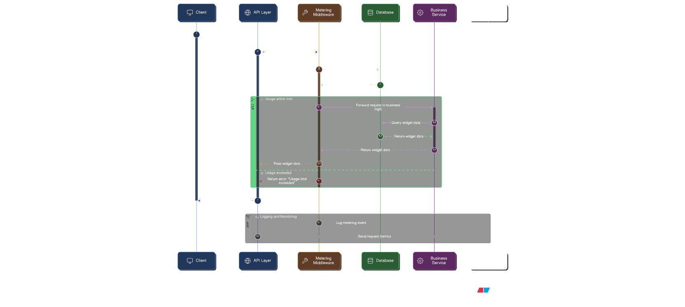

# Multi-Tenant SaaS Subscription & Usage Metering Platform

A **concurrency-safe API backend** for usage-based billing — a pattern common to modern API-driven SaaS products where requests must be counted atomically across concurrent users.

---

## 1. The Problem

In the API economy, pricing is usage-based (pay-per-call, pay-per-minute). Building a system that counts requests accurately under load is non-trivial:

- **Race Conditions:** Two requests arriving simultaneously on a naive counter read the same value and both write `count + 1`, counting only once instead of twice. This causes **undercounting**, which breaks billing accuracy.
- **Latency:** Checking a database on every request introduces lock contention, connection pool pressure, and write amplification — all of which compound under concurrent load.
- **Multi-Tenancy:** Enforcing per-organization quota windows while maintaining strict isolation between tenants is non-trivial, especially across concurrent sessions.

---

## 2. My Solution

I built a **Modular Monolith** backend that handles usage tracking and quota enforcement:

- **Atomic Accounting:** Database-level atomic increments (`UPDATE ... SET count = count + 1 WHERE count < limit`) prevent lost increments under concurrent load, verified by concurrency tests.
- **Tenant Isolation:** Built-in concept of "Organizations" — all users under one org share a quota.
- **Dynamic Enforcement:** Limits are validated in real-time. Exceeding the quota immediately returns `429 Too Many Requests` with a countdown timer.
- **Self-Healing Windows:** Usage is stored in time buckets, not reset by a cron job. The system recovers automatically after downtime.

---

## 3. Architecture

The system follows a clean layered architecture separating routing, business logic, and data:



### Key Components

| Component      | File                   | Responsibility                               |
| -------------- | ---------------------- | -------------------------------------------- |
| **Gatekeeper** | `api/deps.py`          | Intercepts every request, enforces quotas    |
| **Accountant** | `core/metering.py`     | Atomic math, window calculations, 429 errors |
| **Models**     | `models/all_models.py` | SQLAlchemy: Users, Orgs, Plans, UsageRecords |
| **Config**     | `core/config.py`       | All settings from env vars; DEMO_MODE toggle |

---

## 4. Project Structure

```text
.
├── backend/
│   ├── app/
│   │   ├── api/
│   │   │   ├── deps.py         # Dependency: rate limit enforcement
│   │   │   ├── health.py       # Health check endpoint
│   │   │   └── api_v1/
│   │   │       └── endpoints/  # login, users, widgets
│   │   ├── core/
│   │   │   ├── config.py       # Settings (env vars, DEMO_MODE)
│   │   │   ├── metering.py     # ← Core business logic
│   │   │   ├── security.py     # JWT + Argon2
│   │   │   └── logging.py      # Structured JSON logging
│   │   ├── models/
│   │   │   └── all_models.py   # SQLAlchemy ORM models
│   │   ├── schemas/            # Pydantic request/response models
│   │   └── main.py             # App entry point, middleware
│   ├── tests/
│   │   ├── core/
│   │   │   └── test_metering.py  # Unit tests (mocked DB)
│   │   └── api/
│   │       └── test_integration.py # Integration tests (full flow)
│   └── alembic/                # DB migrations
├── scripts/
│   └── benchmark.py            # Concurrency benchmark script
├── Dockerfile                  # Multi-stage build, non-root user
├── docker-compose.yml
├── BENCHMARKS.md
└── IMPLEMENTATION_JOURNEY.md
```

---

## 5. Quick Start

### Prerequisites

- Docker & Docker Compose

### Run

```bash
# 1. Clone the repo
git clone https://github.com/Krishna-pendyala05/saas-metering-engine.git
cd saas-metering-engine

# 2. Start everything (DB + API)
docker-compose up -d --build

# 3. Open the interactive API docs
open http://localhost:8000/docs
```

### Try the Metering (Walkthrough)

1. **Sign Up** → `POST /api/v1/users/`
2. **Login** → Click "Authorize" in Swagger UI
3. **Check Profile** → `GET /api/v1/users/me` (shows your Organization and Plan)
4. **Hit the Metered Endpoint** → `GET /api/v1/widgets/`
   - Watch `X-RateLimit-Remaining` decrease in the response headers
   - After 5 requests (demo default), receive `429 Too Many Requests`

---

## 6. Running Tests

```bash
# Unit + integration tests inside Docker (recommended)
docker exec saas-subscriptionusagemetering-backend-1 \
  python -m pytest /app/backend/tests/ -v

# Or locally
cd backend && pytest
```

---

## 7. Technology Stack

| Technology             | Role             | Rationale                                                  |
| :--------------------- | :--------------- | :--------------------------------------------------------- |
| **FastAPI**            | Web Framework    | Async, auto-generated Swagger docs, high performance       |
| **PostgreSQL**         | Database         | ACID compliance — billing data requires strict consistency |
| **SQLAlchemy (async)** | ORM              | Type-safe models, async query support via asyncpg          |
| **Argon2 / JWT**       | Auth             | Industry-standard password hashing + stateless tokens      |
| **Docker**             | Containerization | Multi-stage build, non-root user, reproducible environment |
| **structlog**          | Logging          | Structured JSON logs for production observability          |

---

## 8. Key Engineering Decisions

| Decision        | Choice                                         | Full rationale                                                                                |
| --------------- | ---------------------------------------------- | --------------------------------------------------------------------------------------------- |
| Counter storage | PostgreSQL atomic `UPDATE`                     | See [Implementation Journey](IMPLEMENTATION_JOURNEY.md#1-the-concurrency-problem--decision)   |
| Reset logic     | Rolling time-bucket rows (no cron job)         | See [Implementation Journey](IMPLEMENTATION_JOURNEY.md#challenge-a-the-reset-logic-fragility) |
| Security        | Env vars, multi-stage Docker, Argon2, Pydantic | See [Implementation Journey](IMPLEMENTATION_JOURNEY.md#3-notable-design-choices)              |

For the full reasoning behind every trade-off, see **[IMPLEMENTATION_JOURNEY.md](IMPLEMENTATION_JOURNEY.md)**.

---

## 9. Performance Benchmarks

Tested with 50 simultaneous concurrent users firing 500 total requests:

| Metric              | Result                                                                                      |
| ------------------- | ------------------------------------------------------------------------------------------- |
| **Throughput**      | ~82–90 req/s (local Docker on Windows)                                                      |
| **Latency (P95)**   | ~1400ms (Local Docker for Windows filesystem overhead; expected <100ms on Linux/Production) |
| **Error Rate**      | **0% — zero errors across 500 concurrent requests**                                         |
| **Race Conditions** | **0 detected**                                                                              |

> For a metering engine, **correctness under concurrency is the critical metric**, not raw throughput. Zero over-limit requests and zero double-counts are the guarantee this system provides.

See [BENCHMARKS.md](BENCHMARKS.md) for the full methodology.

```bash
python scripts/benchmark.py
```

---

## 10. Operating Modes

| Mode           | Window                            | Config            | Purpose                                             |
| -------------- | --------------------------------- | ----------------- | --------------------------------------------------- |
| **Demo**       | 5-minute rolling reset            | `DEMO_MODE=true`  | Lets reviewers observe the rate-limit reset quickly |
| **Production** | Monthly reset (1st of month, UTC) | `DEMO_MODE=false` | Real SaaS billing behavior                          |

---

## 11. Troubleshooting

### `Error: port is already allocated`

Stop existing containers: `docker-compose down`. The DB is exposed on port `5435` (not `5432`) to avoid local conflicts.

### `alembic: command not found`

Run `docker-compose build` to rebuild the image with all dependencies.

### `401 Unauthorized`

Use the "Authorize" button in Swagger UI to set the `Bearer <token>` header automatically.

---

## 12. Extension Points

- **Stripe Integration:** Add a webhook handler — on payment success, update `organization.plan_id` to a higher tier plan.
- **Tiered Endpoints:** Assign different "credit costs" per endpoint (heavy = 5 credits, light = 1 credit) by wrapping `check_usage_limits`.
- **High-Scale Caching:** For millions of RPM, implement **Redis with Lua scripting** for atomic counters, using a **Write-Behind** pattern to async-flush limits to PostgreSQL for durability.

---

**Built by Murali Krishna Pendyala**

[BENCHMARKS.md](BENCHMARKS.md) · [Implementation Journey](IMPLEMENTATION_JOURNEY.md)
